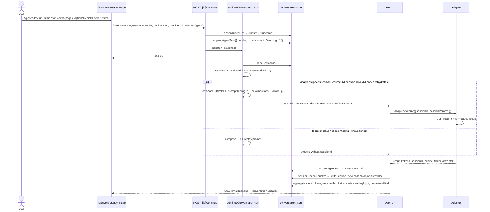
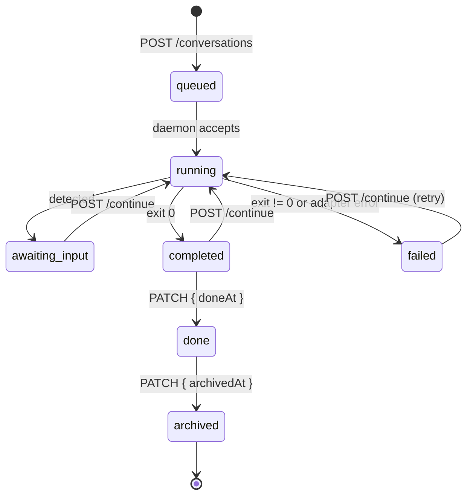

# Tasks / Conversations Continuity + Multi-Provider Runtime — PRD

**Status:** Historical Cabinet-mode contract baseline. Current source map and Hermes-mode behavior are documented in `docs/CLAUDE.md`.
**Owners:** Cabinet core team.
**Companion docs:** [`PROVIDER-CLI.md`](./PROVIDER-CLI.md) (runtime detail), [`CALENDAR_RUN_LINKAGE.md`](./CALENDAR_RUN_LINKAGE.md) (scheduler linkage), [`CLAUDE.md`](./CLAUDE.md) (project rules), [`SIDEBAR.md`](./SIDEBAR.md), [`EDITOR.md`](./EDITOR.md), [`PROGRESS.md`](../PROGRESS.md).

The core file-backed conversation principles still inform Cabinet mode, but the 11-surface matrix and many component paths below capture the April 2026 design and are not a current route inventory. Hermes mode forces `hermes` / `hermes_runtime` and hides Cabinet provider selection.

---

## 0. How to read this document

This PRD is organized around **contracts**, not features. The goal isn't to ship an 11-surface, 8-provider matrix of bespoke integrations — it's to ship **one** conversation system and expose it through 11 surfaces and 8 providers by routing everything through a small, unforgiving set of shared primitives.

The structure is:

- **Part A — The Contracts** (§1–§7). The spine. Every UI surface and every provider plugs in here. If a change doesn't fit a contract, the contract is wrong and this doc changes before the code does.
- **Part B — The Surfaces** (§8–§10). How each of the 11 entry points funnels into the contracts. UX rules.
- **Part C — Operations** (§11). How we see what's happening.
- **Part D — Proof** (§12–§13). The verification grid that proves the system works end-to-end, and the gap register that tracks what's still missing.
- **Part E — Reference** (§14 + appendices). Non-goals, glossary, cross-refs, adapter-authoring cookbook.

Every section tagged **🎯 Contract** is a hard rule. Violations are blockers, not style preferences. Every section tagged **⚠️ Gap** is a known deviation from the target state, with a pointer to what unblocks it.

---

# Part A — The Contracts

## 1. Overview & Invariants

Cabinet is an AI-first knowledge base where **any prompt, typed anywhere in the product, becomes a first-class, resumable conversation** routed through the user's chosen CLI provider (Claude Code, Codex, Gemini, Cursor, OpenCode, Pi, Grok, Copilot). A conversation is the single unit of work — it lives on disk as markdown, renders on the tasks board and the scheduler calendar, streams live via SSE, and can be continued in-place for as many turns as the user wants. Jobs and heartbeats create the same kind of conversation; the product never forks into parallel "task" vs "session" stacks.

### 1.1 Core invariants 🎯 Contract

These are hard rules. Future work lives within them, not around them.

1. **Single store.** Every conversation — manual, editor, scheduled, heartbeat — lives under `data/{cabinetPath}/.agents/.conversations/{id}/`. No sibling stores.
2. **Single server runner.** `src/lib/agents/conversation-runner.ts` owns all prompt assembly (`buildAgentContextHeader` + `buildKnowledgeBaseScopeInstructions` + `buildDiagramOutputInstructions` + `buildCabinetEpilogueInstructions` + `buildMentionContext`) and dispatches to the daemon.
3. **Single client entry.** `src/lib/agents/conversation-client.ts::createConversation` is the only client-side call site for `POST /api/agents/conversations`. Surfaces do not `fetch()` the route directly.
4. **Single composer primitive.** `src/components/composer/composer-input.tsx` + `src/hooks/use-composer.ts` are the shared prompt input, with `task-runtime-picker.tsx` as the pluggable runtime selector.
5. **Single viewer.** `src/components/tasks/conversation/task-conversation-page.tsx` is the one UI that reads conversations. Variants: `full`, `compact`, `readOnly`.
6. **Provider-agnostic execution.** All CLI integrations implement `AgentExecutionAdapter` (`src/lib/agents/adapters/types.ts`). Adding a provider is a plugin, not a rewrite.
7. **Cwd discipline.** The adapter process always runs with `cwd = data/{cabinetPath}`, never `DATA_DIR`. `@mentions` like `@Harry Potter Poems` resolve to the right cabinet.
8. **Cabinet block trailer is mandatory.** Every agent turn output must end with a `SUMMARY:` / `CONTEXT:` / `ARTIFACT:` block inside a ```cabinet``` fence. `<ask_user>…</ask_user>` is the explicit convention for awaiting-input states.
9. **Conversation files on disk are source of truth.** SQLite may hold local runtime/index records, but it is not the canonical conversation store. Restart, re-index, or rebuild without losing the durable conversation record.
10. **No per-surface forks.** If a surface needs behavior the shared primitive doesn't have, extend the primitive. Do not fork.
11. **UX-relevant events are published from the Next.js process.** The daemon runs in its own Node process with its own event bus; SSE subscribers live in Next.js and never see daemon-side events. Every live UX signal (turn streaming, task completion, tree-changed) must be emitted by — or polled for by — Next.js code. See §14.5.

### 1.2 Non-goals

- Not building an HTTP-only Anthropic adapter (CLI-first for now).
- Not deprecating `WebTerminal` — it stays for interactive shells and experimental workflows.
- Not merging with `task-inbox.ts` (that's an unrelated agent-to-agent handoff system under `data/{cabinet}/.agents/{agentSlug}/tasks/`).
- Not adding voice, mobile, or swarm fan-out in this revision.
- Not building per-surface prompt composers. One shared composer primitive only.
- Not moving the canonical conversation store into SQLite. Disk remains the durable conversation store.

### 1.3 Success criteria

The system is done when **the verification matrix in §12 is green across all 88 cells** (11 surfaces × 8 providers). Not earlier.

---

## 2. Shared-Code Contract 🎯 Contract

This section is the reason the doc exists. Every surface and every provider funnels through the same primitives. The list is short on purpose — if it grows, the architecture has drifted.

### 2.1 The seven shared primitives

| # | Primitive | File | Role | Consumers |
|---|-----------|------|------|-----------|
| 1 | **Types** | `src/types/conversations.ts` | `ConversationMeta`, `ConversationTurn`, `ConversationDetail`, `CreateConversationRequest`, `ConversationRuntimeOverride`, `SessionHandle` | everything |
| 2 | **Client** | `src/lib/agents/conversation-client.ts` | `createConversation(request)` — the only way to POST a new conversation from the browser | every entry surface |
| 3 | **Composer UI** | `src/components/composer/composer-input.tsx` + `mention-chips.tsx` + `mention-dropdown.tsx` + `task-runtime-picker.tsx` | Textarea + mention picker + runtime picker. Presentation-only. | every entry surface |
| 4 | **Composer state** | `src/hooks/use-composer.ts` (`useComposer`) | Holds input + mentions + dropdown state; returns `submit(directMessage?)` | every entry surface |
| 5 | **Server runner** | `src/lib/agents/conversation-runner.ts` | `startConversationRun`, `continueConversationRun`. Owns persona, scope, mentions, epilogue assembly. | API routes, jobs, heartbeats |
| 6 | **Store** | `src/lib/agents/conversation-store.ts` + `conversation-turns.ts` | `createConversation`, `appendUserTurn`, `appendAgentTurn`, `updateAgentTurn`, `finalizeConversation`, `readSession`, `writeSession` | runner only |
| 7 | **Adapter registry** | `src/lib/agents/adapters/registry.ts` + `types.ts` | `AgentExecutionAdapter` interface, `agentAdapterRegistry`, `defaultAdapterTypeForProvider` | runner, daemon |

### 2.2 Auxiliary shared primitives

| Primitive | File | Role |
|---|---|---|
| Event bus | `src/lib/agents/conversation-events.ts` | In-process pub/sub; SSE routes subscribe and fan out |
| Task client | `src/lib/agents/task-client.ts` | Client wrappers for `GET /[id]`, `PATCH`, `POST /continue` |
| Provider registry | `src/lib/agents/provider-registry.ts` | User-visible provider catalog (id, display, icon, models) |
| Persona manager | `src/lib/agents/persona-manager.ts` | Reads agent persona markdown, feeds header into runner |
| Mention context builder | `buildMentionContext` in runner | Inlines page content for `@mentions` into the prompt |
| Adapter environment check | `src/lib/agents/adapters/environment.ts` | Shared "is this CLI installed and authenticated?" logic |
| Stream helpers | `src/lib/agents/adapters/{claude,codex,cursor,gemini,opencode,pi}-stream.ts` | Shared JSON-line parsing for each CLI's event stream format |

### 2.3 The viewer primitive

| Primitive | File | Role |
|---|---|---|
| `TaskConversationPage` | `src/components/tasks/conversation/task-conversation-page.tsx` | Canonical conversation viewer. Variants: `full` (standalone page), `compact` (panel embed), `readOnly` (archived/historical) |
| `TaskComposerPanel` | `src/components/tasks/conversation/task-composer-panel.tsx` | Continue-turn composer wrapped around `ComposerInput` + `useComposer` + `TaskRuntimePicker` |
| `TurnBlock` | `src/components/tasks/conversation/turn-block.tsx` | Renders a single turn including inline artifact strip |
| `ArtifactsList` | `src/components/tasks/conversation/artifacts-list.tsx` | Artifacts tab — KB-page cards |
| `DiffPanel` | `src/components/tasks/conversation/diff-panel.tsx` | Turn-level git-diff rendering |
| `LogsPanel` | `src/components/tasks/conversation/logs-panel.tsx` | Raw transcript, stderr, adapter command, session handle |

### 2.4 Hard rules (what you must NOT do)

> These rules exist because each violation has cost us reliability in the past.

1. ❌ **Don't call `fetch("/api/agents/conversations")` directly from a component.** Use `createConversation` from `conversation-client.ts`. Guarantees consistent error handling + payload validation.
2. ❌ **Don't build a new composer for a new surface.** Import `ComposerInput` + `useComposer`. If a need doesn't fit the hook, extend the hook.
3. ❌ **Don't write to `.agents/.conversations/` outside `conversation-store.ts`.** The store owns file layout; any bypass will desync `meta.json` and the turns directory.
4. ❌ **Don't branch on `providerId` in the runner.** Provider differences live behind the adapter interface. If you find yourself writing `if (providerId === "claude-code")`, the adapter contract is missing a capability flag.
5. ❌ **Don't persist session state outside `session.json`.** No `claude.session`, no `codex.resume`, no sidecar files per provider. The codec contract is the abstraction.
6. ❌ **Don't bypass the cabinet block parser.** Agent output without a `SUMMARY/CONTEXT/ARTIFACT` block is a provider bug, not something to patch around in a specific surface.
7. ❌ **Don't render a conversation with anything other than `TaskConversationPage`.** Quick-peek panels use the `compact` variant. Read-only history uses `readOnly`. Do not reimplement turn rendering.

### 2.5 Per-surface wiring — canonical pattern

Every entry surface follows **exactly** this pattern. The only things that vary are the `agentSlug`, the `cabinetPath`, what gets auto-attached in `mentionedPaths`, and what happens after submit (redirect vs inline stream).

```tsx
"use client";
import { ComposerInput } from "@/components/composer/composer-input";
import { useComposer } from "@/hooks/use-composer";
import { createConversation } from "@/lib/agents/conversation-client";

function MySurface({ cabinetPath, agentSlug, mentionableItems }) {
  const composer = useComposer({
    items: mentionableItems,
    onSubmit: async ({ message, mentionedPaths }) => {
      const { conversation } = await createConversation({
        userMessage: message,
        agentSlug,
        cabinetPath,
        mentionedPaths,
        source: "manual",
        // optional: providerId, adapterType, model, effort
      });
      // surface decides: redirect, stream inline, etc.
      router.push(`/#/ops/tasks/${conversation.id}`);
    },
  });
  return <ComposerInput composer={composer} /* ... */ />;
}
```

---

## 3. Type Contract 🎯 Contract

Source of truth: `src/types/conversations.ts`. All fields below come from the live file.

### 3.1 `ConversationMeta` — the row

```ts
interface ConversationMeta {
  id: string;                                   // nanoid-ish, stable
  agentSlug: string;                            // persona; "editor" | "general" | "<slug>"
  cabinetPath?: string;                         // drives cwd + scope
  title: string;                                // from makeTitle(userMessage); editable
  trigger: "manual" | "job" | "heartbeat";
  status: "running" | "completed" | "failed" | "cancelled";
  startedAt: string;                            // ISO8601
  completedAt?: string;
  exitCode?: number | null;
  jobId?: string; jobName?: string; scheduledAt?: string;
  providerId?: string;
  adapterType?: string;
  adapterConfig?: Record<string, unknown>;      // { model?, effort?, ... }
  promptPath: string;
  transcriptPath: string;
  mentionedPaths: string[];                     // cumulative across turns
  artifactPaths: string[];                      // cumulative
  summary?: string;                             // from SUMMARY: trailer
  contextSummary?: string;                      // from CONTEXT: trailer
  turnCount?: number;                           // legacy single-shot = absent = 1
  lastActivityAt?: string;
  tokens?: ConversationTokens;                  // aggregated
  runtime?: { contextWindow?: number };         // cached from adapter
  doneAt?: string; archivedAt?: string;         // user overlays
  awaitingInput?: boolean;                      // <ask_user> parse
  titlePinned?: boolean;                        // blocks auto-retitle
  summaryEditedAt?: string;                     // 5-min auto-summary cooldown
}
```

#### ⚠️ Proposed additions (see §7.5 and §13)

These fields are referenced by the UX but **not yet in `ConversationMeta`**:

```ts
errorKind?: ConversationErrorKind;    // see §7.5 taxonomy
errorHint?: string;                    // human-facing remediation copy
lastResumeAttempt?: {                  // observability for resume vs replay
  at: string;
  result: "resumed" | "replayed" | "failed";
  reason?: string;
};
```

### 3.2 `ConversationTurn`

```ts
interface ConversationTurn {
  id: string;
  turn: number;                                 // 1-indexed
  role: "user" | "agent";
  ts: string;
  content: string;
  sessionId?: string;                           // resume id captured at this turn
  tokens?: { input: number; output: number; cache?: number };
  awaitingInput?: boolean;
  pending?: boolean;                            // agent turn while running
  exitCode?: number | null;
  error?: string;
  mentionedPaths?: string[];
  artifacts?: string[];
}
```

### 3.3 `SessionHandle`

```ts
interface SessionHandle {
  kind: string;                                 // adapter type, e.g. "claude-local"
  resumeId?: string;                            // Claude --resume id, OpenCode session id, ...
  threadId?: string;                            // provider-specific extra
  alive: boolean;                               // set false on clearSession or expiry
  lastUsedAt?: string;
}
```

`session.json` persists this plus a codec blob (see §7.4):

```json
{
  "kind": "claude-local",
  "resumeId": "abc123",
  "alive": true,
  "lastUsedAt": "2026-04-18T12:00:00Z",
  "codecBlob": { /* adapter-specific, produced by sessionCodec.serialize */ }
}
```

### 3.4 `ConversationRuntimeOverride` + `CreateConversationRequest`

```ts
interface ConversationRuntimeOverride {
  providerId?: string;
  adapterType?: string;
  model?: string;
  effort?: string;
}

interface CreateConversationRequest extends ConversationRuntimeOverride {
  source?: "manual" | "editor";
  agentSlug?: string;
  userMessage: string;
  mentionedPaths?: string[];
  cabinetPath?: string;
  pagePath?: string;
}
```

### 3.5 `ConversationDetail` (returned by `GET /[id]?withTurns=1`)

```ts
interface ConversationDetail {
  meta: ConversationMeta;
  prompt: string;                               // turn 1 prompt.md body
  request: string;                              // parsed user request
  transcript: string;                           // turn 1 clean transcript
  rawTranscript: string;                        // ANSI-dirty raw
  mentions: string[];
  artifacts: ConversationArtifact[];            // { path, label? }[]
  turns?: ConversationTurn[];
  session?: SessionHandle | null;
}
```

---

## 4. On-Disk Layout 🎯 Contract

```
data/{cabinetPath}/.agents/.conversations/{id}/
├── meta.json            ConversationMeta
├── prompt.md            Turn 1 user text, with YAML frontmatter
├── transcript.txt       Turn 1 agent raw stdout (ANSI-stripped at read time)
├── turns/               Present only when turnCount > 1
│   ├── 002-user.md
│   ├── 002-agent.md     Frontmatter: tokens, sessionId, artifacts, awaitingInput, exitCode, error
│   ├── 003-user.md
│   └── …
├── session.json         { kind, resumeId?, codecBlob?, threadId?, alive, lastUsedAt }
├── events.log           Append-only JSON lines — for SSE reconnect replay
└── artifacts.json       Denormalized artifact index { turn, pagePath, pageType }
```

### 4.1 Turn frontmatter

```yaml
---
id: <nanoid>
turn: 2
role: agent
ts: 2026-04-18T14:23:01Z
sessionId: abc123
tokens:
  input: 4200
  output: 310
  cache: 12000
awaitingInput: false
exitCode: 0
mentionedPaths:
  - marketing/blog/harry-potter-poems/index.md
artifacts:
  - marketing/blog/harry-potter-poems/index.md
---
<turn body>
```

### 4.2 Cabinet block trailer 🎯 Contract

Every agent turn's output **must** end with:

````
```cabinet
SUMMARY: Drafted three Harry Potter poems, stored them as a cabinet page.
CONTEXT: Style reference is Dr. Seuss meets Tolkien; user wants stanza-length lines.
ARTIFACT: marketing/blog/harry-potter-poems/index.md
ARTIFACT: marketing/blog/harry-potter-poems/assets/cover.png
```
````

- `SUMMARY:` → `meta.summary` (user-visible card subtitle; editable).
- `CONTEXT:` → `meta.contextSummary` (appended to agent's `context.md` on completion for future-turn memory).
- `ARTIFACT:` → each cabinet path is added to `meta.artifactPaths` and rendered as a KB-page card in the Artifacts tab.

### 4.3 Awaiting-input convention 🎯 Contract

When the agent needs human input mid-run, it wraps the question:

```
<ask_user>
Should I publish these as one page or three? Say "one page" or "three pages".
</ask_user>
```

The runner sets `meta.awaitingInput = true`. UI shows an amber ring + helper copy on the composer. Any `/continue` POST clears the flag.

### 4.4 `events.log` lines

One JSON object per line, append-only:

```json
{"seq":42,"ts":"2026-04-18T14:23:01Z","type":"turn.appended","turn":2,"role":"agent","pending":false}
```

Types: `conversation.created`, `conversation.updated`, `turn.appended`, `turn.updated`, `conversation.completed`, `conversation.failed`. SSE clients reconnect with `Last-Event-ID: <seq>` and receive everything after.

---

## 5. API Contract 🎯 Contract

All routes under `src/app/api/agents/`. Canonical shapes.

### 5.1 Route table

| Method | Path | Purpose | Body / Params |
|--------|------|---------|---------------|
| `POST` | `/conversations` | Create + start a conversation | `CreateConversationRequest` (§3.4) |
| `GET` | `/conversations` | List metas | Query: `agent`, `pagePath`, `trigger`, `status`, `cabinetPath`, `visibilityMode`, `limit` |
| `GET` | `/conversations/[id]?withTurns=1` | Detail + turns + session handle | `withTurns=0` → legacy shape |
| `PATCH` | `/conversations/[id]` | Update editable fields | `{ summary?, title?, doneAt?, archivedAt?, titlePinned?, status? }` |
| `DELETE` | `/conversations/[id]` | Soft delete → `.cabinet-backups/` | — |
| `POST` | `/conversations/[id]/continue` | Follow-up turn | `{ userMessage, mentionedPaths?, cabinetPath?, providerId?, adapterType?, model?, effort? }` |
| `GET` | `/conversations/[id]/events` | SSE per-conversation | Header: `Last-Event-ID` optional |
| `GET` | `/conversations/events` | SSE global (board + calendar) | — |
| `POST` | `/conversations/[id]/compact` | Haiku rewrite of summary + contextSummary | — |
| `GET` | `/conversations/[id]/diffs` | Turn-level file diffs | Query: `turn` |
| `GET` | `/conversations/[id]/events-log` | Raw replay of `events.log` | Query: `fromSeq` |
| `GET` | `/providers` | Provider catalog | — |
| `GET` | `/providers/status` | Health per provider | — |
| `POST` | `/providers/[id]/verify` | 1-prompt smoke test | Body: `{ model?, effort? }` |

### 5.2 Canonical request — create conversation

```ts
POST /api/agents/conversations
Content-Type: application/json

{
  "userMessage": "write me 3 harry potter poems",
  "agentSlug": "general",               // optional; defaults by surface
  "cabinetPath": "marketing/blog",      // optional; drives cwd + scope
  "pagePath": "marketing/blog/poems",   // optional; auto-attaches page as mention
  "mentionedPaths": ["marketing/brand/voice.md"],
  "providerId": "claude-code",          // optional; falls back to default
  "adapterType": "claude-local",        // optional; derived from providerId
  "model": "claude-sonnet-4-6",         // optional
  "effort": "medium",                   // optional
  "source": "manual"                    // "manual" | "editor"
}
```

**Response** (201):

```ts
{ "ok": true, "conversation": ConversationMeta }
```

### 5.3 Canonical response — get conversation with turns

```ts
GET /api/agents/conversations/{id}?withTurns=1

{
  "meta": ConversationMeta,
  "prompt": "...",
  "request": "...",
  "transcript": "...",
  "rawTranscript": "...",
  "mentions": ["..."],
  "artifacts": [{ "path": "...", "label": "..." }],
  "turns": [ConversationTurn, ...],
  "session": { "kind": "claude-local", "resumeId": "abc123", "alive": true }
}
```

### 5.4 SSE event shape

```
event: turn.appended
id: 42
data: {"type":"turn.appended","turn":2,"role":"agent","pending":false,"conversationId":"..."}
```

### 5.5 Error envelope 🎯 Contract

Every 4xx/5xx response from this subtree MUST use:

```ts
{
  "ok": false,
  "error": "human-readable message",
  "errorKind": ConversationErrorKind,   // §7.5
  "errorHint"?: "optional remediation copy"
}
```

⚠️ **Gap** — today the create/continue routes return mixed shapes. Target: every route in §5.1 returns this envelope on error. Blocks: generic error-classification (§7.5).

---

## 6. Server Runner Contract 🎯 Contract

Source: `src/lib/agents/conversation-runner.ts`.

### 6.1 Entry points

```ts
export async function startConversationRun(input: StartConversationInput): Promise<ConversationMeta>;
export async function continueConversationRun(input: ContinueConversationInput): Promise<void>;
```

Both are called from API routes (`POST /conversations`, `POST /[id]/continue`) **and** from internal triggers (`src/lib/jobs/*`, `src/lib/agents/heartbeat.ts`) with `trigger ∈ {"manual","job","heartbeat"}`.

### 6.2 Prompt assembly order

First turn (`startConversationRun`) composes in this order, joined by `\n\n`:

1. `buildAgentContextHeader(persona, agentSlug)` — persona body + role line.
2. Knowledge-base scope (`buildKnowledgeBaseScopeInstructions(cwd, cabinetPath)`).
3. Diagram output rules (`buildDiagramOutputInstructions`).
4. Cabinet epilogue rules (`buildCabinetEpilogueInstructions`).
5. Mention context (`buildMentionContext(mentionedPaths)`) — inlines each referenced page as a `<mention>` block.
6. The user message.

Continue turn (`continueConversationRun`) — two modes:

| Condition | Mode | Prompt contents |
|-----------|------|-----------------|
| Resume available (see §7.4) | **Trimmed** | epilogue + mentions (new only) + follow-up message |
| Session dead / codec missing / adapter doesn't support | **Replay** | persona + scope + diagram + epilogue + prior turns + follow-up |
| Tokens > 80% of `runtime.contextWindow` | **Summary-first replay** | persona + scope + diagram + epilogue + `meta.summary + meta.contextSummary` (instead of full prior turns) + follow-up |

### 6.3 Runner responsibilities

The runner is the ONLY place that:

- Creates / writes `meta.json` (via the store).
- Serializes + deserializes `session.json` via `adapter.sessionCodec`.
- Parses the cabinet block trailer out of adapter output.
- Sets `meta.awaitingInput`.
- Aggregates `meta.tokens` across turns.
- Writes `meta.errorKind` + `meta.errorHint` from `adapter.classifyError`.
- Calls `adapter.execute(ctx)` via the daemon.

### 6.4 ⚠️ Gap — runner does not persist codec blobs

Today `continueConversationRun` never calls `adapter.sessionCodec?.serialize(result.sessionParams)` after a run. Only `resumeId` ends up in `session.json`. This is why resume works for Claude (which only needs `resumeId`) but fails silently for Cursor / Gemini / Pi / OpenCode / Grok / Copilot. See §7.4 + §13.

---

## 7. Adapter Contract 🎯 Contract

Source: `src/lib/agents/adapters/types.ts`. Adding a new provider = implementing this interface. Nothing else.

### 7.1 `AgentExecutionAdapter`

```ts
interface AgentExecutionAdapter {
  type: string;                                 // registry key, e.g. "claude-local"
  name: string;                                 // display
  description?: string;
  providerId?: string;                          // links to provider catalog
  executionEngine: "legacy_pty_cli" | "structured_cli" | "api" | "http" | "process";
  experimental?: boolean;
  supportsSessionResume?: boolean;
  supportsDetachedRuns?: boolean;
  models?: AgentAdapterModel[];
  effortLevels?: AgentAdapterEffortLevel[];
  sessionCodec?: AdapterSessionCodec;
  listModels?(): Promise<AgentAdapterModel[]>;
  listSkills?(ctx: { cwd?: string }): Promise<AdapterSkillSnapshot>;
  syncSkills?(ctx: { cwd?: string }, desiredSkills: string[]): Promise<AdapterSkillSnapshot>;
  testEnvironment(ctx?: AdapterEnvironmentTestContext): Promise<AdapterEnvironmentTestResult>;
  execute?(ctx: AdapterExecutionContext): Promise<AdapterExecutionResult>;

  // ⚠️ Proposed additions (see §7.5, §13):
  classifyError?(stderr: string, exitCode: number | null): ConversationErrorClassification;
}
```

### 7.2 `AdapterExecutionContext` + `AdapterExecutionResult`

```ts
interface AdapterExecutionContext {
  runId: string;
  adapterType: string;
  config: Record<string, unknown>;              // model, effort, adapter-specific knobs
  prompt: string;                               // fully assembled by runner
  cwd: string;                                  // data/{cabinetPath}
  timeoutMs?: number;
  sessionId?: string | null;                    // present on resume
  sessionParams?: Record<string, unknown> | null; // rehydrated codec blob on resume
  onLog: (stream: "stdout" | "stderr", chunk: string) => Promise<void>;
  onMeta?: (meta: AdapterInvocationMeta) => Promise<void>;
  onSpawn?: (meta: { pid: number; processGroupId: number | null; startedAt: string }) => Promise<void>;
}

interface AdapterExecutionResult {
  exitCode: number | null;
  signal: string | null;
  timedOut: boolean;
  errorMessage?: string | null;
  errorCode?: string | null;
  usage?: { inputTokens: number; outputTokens: number; cachedInputTokens?: number };
  sessionId?: string | null;                    // adapter-agnostic handle (e.g. Claude resume-id)
  sessionParams?: Record<string, unknown> | null; // adapter-specific; feeds sessionCodec.serialize
  sessionDisplayId?: string | null;
  provider?: string | null;
  model?: string | null;
  billingType?: "api" | "subscription" | "metered_api" | "credits" | "unknown" | null;
  summary?: string | null;
  output?: string | null;
  clearSession?: boolean;                       // force alive:false (e.g. session-expired)
}
```

### 7.3 Registry

```ts
// src/lib/agents/adapters/registry.ts
agentAdapterRegistry.register(claudeLocalAdapter);
agentAdapterRegistry.register(codexLocalAdapter);
agentAdapterRegistry.register(geminiLocalAdapter);
agentAdapterRegistry.register(cursorLocalAdapter);
agentAdapterRegistry.register(openCodeLocalAdapter);
agentAdapterRegistry.register(piLocalAdapter);
agentAdapterRegistry.register(grokLocalAdapter);
agentAdapterRegistry.register(copilotLocalAdapter);
agentAdapterRegistry.register(legacyClaudeCodeAdapter);   // escape hatch
agentAdapterRegistry.register(legacyCodexCliAdapter);     // escape hatch
```

Plus `plugin-loader.ts` supports external adapters via `registerExternal` / `unregisterExternal` (used by the future provider plugin marketplace).

### 7.4 Session codec contract 🎯 Contract

Source: `src/lib/agents/adapters/types.ts`.

```ts
interface AdapterSessionCodec {
  deserialize(raw: unknown): Record<string, unknown> | null;
  serialize(params: Record<string, unknown>): Record<string, unknown> | null;
  getDisplayId?(params: Record<string, unknown>): string | null;
}
```

Rules:

1. The codec is how `session.json` stays provider-agnostic.
2. **After every run**, the runner MUST call `adapter.sessionCodec?.serialize(result.sessionParams)` and write the returned blob into `session.json.codecBlob`.
3. **Before every continue**, the runner MUST call `adapter.sessionCodec?.deserialize(session.codecBlob)` and pass the result as `ctx.sessionParams`.
4. `getDisplayId` produces a user-facing handle (e.g. "Claude #abc123") for the Logs tab.

### 7.5 Error classification contract 🎯 Contract (proposed)

Each `*-local.ts` adapter must expose:

```ts
type ConversationErrorKind =
  | "cli_not_found"     // binary missing on PATH
  | "auth_expired"      // login token invalid/expired
  | "rate_limited"      // provider throttled
  | "session_expired"   // resume id rejected
  | "context_exceeded"  // over context window
  | "transport"         // network/daemon crash
  | "timeout"           // run exceeded timeoutMs
  | "unknown";          // unmapped stderr

interface ConversationErrorClassification {
  kind: ConversationErrorKind;
  hint?: string;                               // remediation copy
  retryAfterSec?: number;                      // rate_limited only
}

interface AgentExecutionAdapter {
  classifyError?(stderr: string, exitCode: number | null): ConversationErrorClassification;
}
```

The runner calls `classifyError` on any failed run and writes `meta.errorKind` + `meta.errorHint`. UI action mapping:

| Kind | UI action |
|------|-----------|
| `cli_not_found` | "Install {provider}" link → `/providers/{id}/install` |
| `auth_expired` | "Re-authenticate" button → opens provider login flow |
| `rate_limited` | "Retry in N seconds" countdown |
| `session_expired` | Silent; next `/continue` forces replay |
| `context_exceeded` | "Compact conversation (Haiku)" CTA |
| `transport` | "Reconnect" button |
| `timeout` | "Extend timeout + retry" |
| `unknown` | Generic retry + link to Logs tab |

⚠️ **Gap** — today only `POST /api/agents/providers/[id]/verify` runs per-provider regex classification. The logic needs to be **lifted into each adapter's `classifyError`** and invoked from the runner's completion path.

### 7.6 How a new provider plugs in (cookbook)

Step-by-step, every line prescriptive:

1. **Register the provider in the catalog.** Add `src/lib/agents/providers/{slug}.ts`, export `{ id, display, iconAsset, models, effortLevels, installMessage, ... }`.
2. **Implement the adapter.** Add `src/lib/agents/adapters/{slug}-local.ts`. Implement `type`, `name`, `providerId`, `executionEngine: "structured_cli"`, `supportsSessionResume`, `testEnvironment`, `execute`, `sessionCodec`, `classifyError`.
3. **Implement the stream parser.** Add `src/lib/agents/adapters/{slug}-stream.ts` — parses the CLI's JSON-line or text event format into token usage + session params + final output. Mirrors the existing `claude-stream.ts` / `codex-stream.ts`.
4. **Wire the default.** Add entry to `DEFAULT_ADAPTER_BY_PROVIDER_ID` in `registry.ts`.
5. **Register it.** Append `agentAdapterRegistry.register({slug}LocalAdapter)` at the bottom of `registry.ts`.
6. **Add provider glyph.** Add an SVG to `public/providers/{slug}.svg`, reference it on `provider.iconAsset`.
7. **Ship a golden-path test.** Add `src/lib/agents/adapters/{slug}-local.test.ts` covering: `testEnvironment` pass path, one-shot `execute`, resume `execute`, each `classifyError` kind.
8. **Add a verification row.** Row 8-N in §12.1.

**No other code changes are required.** Surfaces, runner, store, viewer all pick it up automatically.

---

# Part B — The Surfaces

## 8. Entry Surfaces — 11 Paths, One Contract

A prompt can originate from **eleven** surfaces. All converge on `createConversation(request)` → `POST /api/agents/conversations` → `conversation-runner.startConversationRun` and all render through `TaskConversationPage`.

### 8.1 Surface inventory 🎯 Contract

| # | Surface | Component | User action | `agentSlug` default | `cabinetPath` default | Auto-attach | Post-submit |
|---|---------|-----------|-------------|---------------------|-----------------------|-------------|-------------|
| 1 | Tasks board "New" | `src/components/tasks/tasks-board.tsx` | `#/ops/tasks` → `+ New` | user-picked | user-picked | none | redirect to `#/ops/tasks/{id}` |
| 2 | `/tasks/new` standalone | `src/app/tasks/new/page.tsx` | URL or `⌘K → New task` | user-picked | user-picked | none | redirect to `#/ops/tasks/{id}` |
| 3 | AI Panel (right rail) | `src/components/ai-panel/ai-panel.tsx` | `⌘J` on any page | `editor` | current page's cabinet | current page auto-mentioned | stream inline; expand → `#/ops/tasks/{id}` |
| 4 | Cabinet task composer | `src/components/cabinets/cabinet-task-composer.tsx` | Cabinet view composer card | cabinet default | cabinet | none | redirect to `#/ops/tasks/{id}` |
| 5 | Home screen prompt | `src/components/home/home-screen.tsx` | `/` when no page is open | `general` | none (global) | none | redirect to `#/ops/tasks/{id}` |
| 6 | Agents workspace run | `src/components/agents/agents-workspace.tsx` | `/agents` → agent → `Run` | selected agent | agent default | none | redirect to `#/ops/tasks/{id}` |
| 7 | Status-bar quick-run | `src/components/layout/status-bar.tsx` | Footer chip | `general` | current | none | redirect to `#/ops/tasks/{id}` |
| 8 | Onboarding wizard | `src/components/onboarding/onboarding-wizard.tsx` | First-run flow | `general` | demo cabinet | demo mention | inline stream, then redirect |
| 9 | Continue turn | `TaskComposerPanel` inside `TaskConversationPage` | Inside existing conversation | **inherited** | **inherited** | user `@mentions` only | stays in place |
| 10 | Scheduled job fire | `src/lib/jobs/*` (node-cron) | cron trigger, no user action | job config | job cabinet | job-configured | appears on board + calendar |
| 11 | Heartbeat tick | `src/lib/agents/heartbeat.ts` | interval | agent config | agent cabinet | agent-configured | appears on board + calendar |

### 8.2 Shared-code matrix — proof of reuse 🎯 Contract

For every surface row above, this MUST be true. This is the bulletproof bar.

| Surface | Uses `ComposerInput` | Uses `useComposer` | Uses `TaskRuntimePicker` | Uses `createConversation` | Renders via `TaskConversationPage` |
|---------|:---:|:---:|:---:|:---:|:---:|
| 1. Tasks board | ✅ | ✅ | ✅ | ✅ | ✅ |
| 2. `/tasks/new` | ✅ | ✅ | ✅ | ✅ | ✅ |
| 3. AI Panel | ✅ | ✅ | ✅ | ✅ | ✅ (compact variant inline) |
| 4. Cabinet composer | ✅ | ✅ | ✅ | ✅ | ✅ |
| 5. Home | ✅ | ✅ | ✅ | ✅ | ✅ |
| 6. Agents workspace | ✅ | ✅ | ✅ | ✅ | ✅ (compact variant embed) |
| 7. Status-bar | ✅ | ✅ | ❌ (uses global default only) | ✅ | ✅ |
| 8. Onboarding | ✅ | ✅ | ✅ | ✅ | ✅ (compact variant) |
| 9. Continue turn | ✅ (via `TaskComposerPanel`) | ✅ | ⚠️ see §13 | N/A (uses `POST /continue`) | ✅ |
| 10. Scheduled job | N/A | N/A | N/A (uses job config) | N/A (uses `startConversationRun` server-side) | ✅ |
| 11. Heartbeat | N/A | N/A | N/A (uses agent config) | N/A (uses `startConversationRun` server-side) | ✅ |

### 8.3 Surface-specific rules

- **AI Panel (3)** auto-attaches the currently open page as a mention. `source: "editor"`. Streams inline; the "Expand" button swaps to `TaskConversationPage` without losing state.
- **Cabinet composer (4)** inherits `cabinetPath` from the cabinet view. Persona picker is cabinet-default unless user overrides.
- **Home (5)** has no cabinet — the prompt runs in the global `/data` root unless the message `@mentions` a page.
- **Status-bar (7)** is deliberately scope-lite — it uses the user's global default runtime and doesn't expose a runtime picker to keep the footer compact.
- **Onboarding (8)** uses the `RuntimeSelectionBanner` variant of the runtime picker to educate the user on provider choice.
- **Scheduled / heartbeat (10, 11)** skip the client composer entirely. They call `startConversationRun` in-process, inside the daemon supervisor.

### 8.4 Note on `source`

The API accepts `source ∈ {"manual","editor"}` (see `ConversationSource` in `src/types/conversations.ts`). The richer 11-surface attribution above is **informational** — `trigger ∈ {"manual","job","heartbeat"}` is the persisted attribution in `ConversationMeta.trigger`. Extending `source` to cover all 11 surfaces is a §13 future item.

---

## 9. Continue Experience

The whole point of this system is that a conversation can continue in place, indefinitely, across providers, without losing context.

### 9.1 Composer rules 🎯 Contract

- **Composer is always mounted** at the bottom of `TaskConversationPage` unless the conversation is `archived` or the viewer is `readOnly`.
- **Awaiting-input state** — composer gets an amber ring and helper text ("Agent is waiting for your reply"). `<ask_user>` body renders above the composer as a blockquote.
- **Per-turn runtime picker** — composer shows the current provider/adapter/model as a chip. Clicking it opens `TaskRuntimePicker` to pick a different runtime for *this* follow-up only. Users can legitimately run turn 1 on Claude, turn 2 on Codex, turn 3 on Gemini. Each turn's frontmatter records its own `adapterType` + `adapterConfig` snapshot.
- **Mentions** — `@` opens the same `MentionDropdown` used by the AI Panel. Attached pages flow through `buildMentionContext` and are added to `mentionedPaths` (and `meta.mentionedPaths` cumulatively).
- **Compact mode** — the 420 px `TaskDetailPanel` side panel, the Agents workspace embed, and the AI Panel quick-peek all render `<TaskConversationPage variant="compact" />` — no outer header, tabs + chat + composer only.
- **Keyboard** — `⌘↩` send, `Esc` blur, `Shift-↵` newline, `⌘K` open mention picker.
- **Retry** — when `status === "failed"`, composer shows a "Retry" button next to Send. Retry re-sends the last user turn.
- **Forget session** — "…" menu on the composer has a "Start fresh session" option that flips `session.json` to `alive:false`, forcing replay on next turn.

### 9.2 Resume vs replay decision matrix 🎯 Contract

Decided inside `continueConversationRun`, using adapter capabilities + persisted `session.json`:

| Condition | Path | Adapter receives |
|-----------|------|------------------|
| `adapter.supportsSessionResume && session.alive && codec.deserialize ≠ null` | **Resume** | trimmed prompt (epilogue + new mentions + follow-up) + `ctx.sessionId = resumeId` + `ctx.sessionParams = deserialized blob` |
| Session dead / codec missing / adapter doesn't support resume | **Replay** | full prompt (persona + scope + diagram + epilogue + prior turns + follow-up) + no session params |
| `meta.tokens.total > 0.8 × runtime.contextWindow` | **Summary-first replay** | replay prompt, but "prior turns" section is `meta.summary + meta.contextSummary` instead of full transcript |

The runner writes `meta.lastResumeAttempt` with `{at, result, reason}` so the UI can explain what happened.

### 9.3 Continue-turn persistence flow

```
POST /[id]/continue
  → appendUserTurn(id, { content: userMessage })
  → appendAgentTurn(id, { pending: true, content: "Working…" })
  → response 202 (client now streams via SSE)
  → (detached) continueConversationRun
      → decide resume vs replay (§9.2)
      → adapter.execute(ctx)
      → parse cabinet block trailer from output
      → parse <ask_user> → meta.awaitingInput
      → updateAgentTurn(id, { content, tokens, sessionId, artifacts, exitCode })
      → sessionCodec.serialize(result.sessionParams) → writeSession
      → classifyError on failure → meta.errorKind + meta.errorHint
      → aggregate meta.tokens, meta.artifactPaths, meta.lastActivityAt
      → publishConversationEvent("conversation.updated")
      → publishConversationEvent("turn.appended", { turn, role: "agent" })
```

---

## 10. Scheduler, Jobs, Heartbeats

- Jobs (`src/lib/jobs/*`, `src/components/jobs/jobs-manager.tsx`) use `node-cron`. Each firing invokes `startConversationRun({ trigger: "job", jobId, jobName, scheduledAt, agentSlug, cabinetPath })`.
- Heartbeats (`src/lib/agents/heartbeat.ts`) do the same with `trigger: "heartbeat"`.
- Calendar renders `ConversationMeta` rows filtered by `scheduledAt` (planned) and `startedAt` (past). Status dot comes from SSE.
- Clicking a calendar row → route to `#/ops/tasks/{id}` (the shared viewer). Same click from the Jobs manager, Agents workspace history, cabinet activity feed, and AI Panel history.
- Full spec in [`CALENDAR_RUN_LINKAGE.md`](./CALENDAR_RUN_LINKAGE.md).

### 10.1 Architecture diagrams

#### First turn: prompt to persisted + streaming

```mermaid
sequenceDiagram
    actor User
    participant UI as Entry surface (any of 11)
    participant Client as conversation-client
    participant API as POST /api/agents/conversations
    participant Runner as conversation-runner
    participant Store as conversation-store
    participant Daemon as cabinet-daemon :4100
    participant Adapter as AgentExecutionAdapter
    participant CLI as Provider CLI
    participant Bus as conversation-events
    participant SSE as /events SSE

    User->>UI: types prompt; picks provider/persona/model
    UI->>Client: createConversation({ userMessage, agentSlug, cabinetPath, providerId?, adapterType?, model?, effort?, mentionedPaths?, source })
    Client->>API: POST /api/agents/conversations
    API->>Runner: startConversationRun
    Runner->>Runner: buildAgentContextHeader + scope + diagram + epilogue + mentions
    Runner->>Store: createConversation → meta.json + prompt.md
    Runner->>Daemon: createStructuredSession({ adapterType, prompt, cwd, adapterConfig })
    API-->>Client: 201 { conversation: ConversationMeta }
    Client-->>UI: ConversationMeta
    UI->>SSE: subscribe /api/agents/conversations/[id]/events
    Daemon->>Adapter: adapter.execute(ctx)
    Adapter->>CLI: spawn (claude / codex / gemini / …)
    CLI-->>Adapter: stdout chunks, exit code, usage
    Adapter-->>Daemon: AdapterExecutionResult { exitCode, usage, sessionId, sessionParams }
    Daemon->>Store: write transcript.txt + parse cabinet trailer
    Daemon->>Store: writeSession({ kind, resumeId, codecBlob, alive })
    Daemon->>Bus: publishConversationEvent { type: "conversation.updated" }
    Bus-->>SSE: stream event
    SSE-->>UI: render done state + artifacts
```

#### Continue turn: resume vs replay



#### Component diagram

```mermaid
flowchart LR
    subgraph UI["UI Surfaces (11)"]
      TCP[TaskConversationPage]
      TB[TasksBoard]
      TDP[TaskDetailPanel]
      AP[AIPanel]
      AW[AgentsWorkspace]
      CAL[CalendarView]
      HOM[HomeScreen]
      CAB[CabinetTaskComposer]
      ONB[OnboardingWizard]
      STB[StatusBar]
      TNE[/tasks/new]
    end

    subgraph Shared["Shared primitives (§2)"]
      CI[ComposerInput]
      UC[useComposer]
      RP[TaskRuntimePicker]
      TCP2[TaskComposerPanel]
      CC[conversation-client]
      TC[task-client]
    end

    subgraph API["Next.js API"]
      POST["POST /conversations"]
      CONT["POST /[id]/continue"]
      PATCH["PATCH /[id]"]
      GET["GET /[id]?withTurns=1"]
      EVT["GET /[id]/events (SSE)"]
      GEVT["GET /events (global SSE)"]
      CMP["POST /[id]/compact"]
      DIF["GET /[id]/diffs"]
      PV["GET /providers"]
      PVV["POST /providers/[id]/verify"]
    end

    subgraph Core["src/lib/agents"]
      CR[conversation-runner]
      CS[conversation-store]
      CT[conversation-turns]
      CE[conversation-events]
      PR[provider-registry]
      AR[adapters/registry]
    end

    subgraph Daemon["cabinet-daemon :4100"]
      SS[Session Supervisor]
      BUS[Event Bus]
    end

    subgraph Adapters["Execution Adapters (§11)"]
      CA[claude-local]
      CX[codex-local]
      GM[gemini-local]
      CU[cursor-local]
      OC[opencode-local]
      PI[pi-local]
      GK[grok-local]
      CP[copilot-local]
      L1[claude_code_legacy]
      L2[codex_cli_legacy]
    end

    Disk[("/data/**/.agents/.conversations/")]

    TB --> CI
    TNE --> CI
    AP --> CI
    CAB --> CI
    HOM --> CI
    AW --> CI
    STB --> CI
    ONB --> CI
    TCP --> TCP2
    TCP2 --> CI
    CI --> UC
    CI --> RP
    UC --> CC
    TCP --> TC

    CC --> POST
    TC --> GET
    TC --> CONT
    TC --> PATCH

    POST --> CR
    CONT --> CR
    PATCH --> CS
    GET --> CS
    EVT --> CE
    GEVT --> CE

    CR --> CS
    CS --> CT
    CR --> PR
    CR --> AR
    AR --> CA & CX & GM & CU & OC & PI & GK & CP & L1 & L2
    CR --> SS
    SS --> Adapters
    SS --> BUS
    BUS --> CE

    CS --> Disk
```

#### Lifecycle state machine



The persisted `ConversationStatus` is one of `running | completed | failed | cancelled`. `awaiting_input`, `done`, `archived` are overlays computed from `meta.awaitingInput`, `meta.doneAt`, `meta.archivedAt`.

---

## 11. Provider Catalog

Eight providers today. Each follows the §7 adapter contract.

### 11.1 Provider × capability matrix 🎯 Contract

| Provider id | Display | Adapter type | `supportsSessionResume` | Auth model | Session codec shape | Stream format |
|---|---|---|:---:|---|---|---|
| `claude-code` | Claude Code | `claude-local` | ✅ `--resume <id>` | `~/.claude` login | `{ resumeId }` | `claude-stream.ts` JSON |
| `codex-cli` | Codex CLI | `codex-local` | ✅ rollout file | OpenAI API key | `{ rolloutPath, resumeId }` | `codex-stream.ts` JSON |
| `gemini-cli` | Gemini CLI | `gemini-local` | ⚠️ via context blob | Google creds | `{ contextBlob }` | `gemini-stream.ts` JSON |
| `cursor-cli` | Cursor CLI | `cursor-local` | ⚠️ via context blob | Cursor login | `{ contextBlob, threadId }` | `cursor-stream.ts` JSON |
| `opencode` | OpenCode | `opencode-local` | ✅ session id | multi | `{ sessionId }` | `opencode-stream.ts` JSON |
| `pi` | Pi | `pi-local` | ❌ replay-only | Inflection creds | n/a | `pi-stream.ts` JSON |
| `grok-cli` | Grok CLI | `grok-local` | ⚠️ via context blob | xAI API key | `{ contextBlob }` | (stream helper TBD) |
| `copilot-cli` | Copilot CLI | `copilot-local` | ⚠️ via context blob | GitHub login | `{ contextBlob }` | (stream helper TBD) |

Every provider also registers a `*_legacy` PTY adapter (`claude_code_legacy`, `codex_cli_legacy`, `cursor_cli_legacy`, `opencode_legacy`, `copilot_cli_legacy`, `grok_cli_legacy`, `pi_legacy`, plus the generic fallback). These power the composer's user-selectable **Terminal** mode — the task streams over the daemon's `/api/daemon/pty` WebSocket into `WebTerminal` instead of producing a structured TurnBlock transcript. The `_legacy` suffix is historical naming; they are first-class runtimes, not escape hatches.

### 11.2 Runtime selection precedence

The runner resolves `(providerId, adapterType, model, effort)` in this order:

1. Explicit fields on the API call (highest).
2. Persona `defaultRuntime` in the persona YAML.
3. Cabinet `defaultRuntime` in the cabinet config.
4. User `defaultRuntime` in app settings.
5. `defaultAdapterTypeForProvider(defaultProviderId)` from `DEFAULT_ADAPTER_BY_PROVIDER_ID`.
6. `providerRegistry.defaultProvider` + `agentAdapterRegistry.defaultAdapterType` (lowest).

This precedence is centralized in `src/lib/agents/adapters/registry.ts::resolveExecutionProviderId`.

### 11.3 Legacy adapter discipline

Legacy PTY adapters exist for two reasons:

1. A user's structured adapter is misbehaving and we need to prove the CLI itself works.
2. We need to debug an edge case in the provider CLI that the structured adapter masks.

They are never the default. They ship as `experimental: true`. They do not implement `sessionCodec` — resume is best-effort via the provider's own conventions.

---

# Part C — Operations

## 12. Observability & Debugging

- **Logs tab inside `TaskConversationPage`** — raw transcript, stderr, adapter command line, session handle dump, `classifyError` result.
- **`events.log` replay** — SSE clients with `Last-Event-ID: N` replay from that offset.
- **Daemon logs** — `~/.cabinet/logs/daemon-*.log` (structured JSON). Also tailed into the in-product Daemon Status panel.
- **Provider verify** — `POST /api/agents/providers/[id]/verify` runs a 1-prompt smoke test and returns classified errors. This is the **canonical reliability check** for a provider — before shipping a new adapter, verify must pass.
- **Chrome DevTools** — `npm run debug:chrome` opens a CDP-debuggable browser at `localhost:9222`.
- **`PROVIDER-CLI.md`** — detailed provider onboarding, adapter authoring, plugin loading.

### 12.1 What the Logs tab MUST show 🎯 Contract

For every conversation, Logs tab renders:

1. Turn-by-turn raw transcript (ANSI-stripped).
2. stderr per turn.
3. Adapter invocation meta: `command`, `cwd`, `commandArgs`, `env`, `prompt`.
4. `session.json` dump with `sessionCodec.getDisplayId` rendered.
5. `meta.errorKind` + `meta.errorHint` if present.
6. `lastResumeAttempt` with reason if replayed.
7. `events.log` offsets for SSE debug.

---

# Part D — Proof

## 13. Verification Matrix

This is the definition of done. Every cell must be green before the system is considered shipped.

### 13.1 Surface × provider grid (11 × 8 = 88 cells)

For each cell, the smoke test is: **submit the same canonical prompt** ("list the files in the current cabinet and summarize"), **confirm all seven post-conditions** listed in §13.2.

|   | `claude-code` | `codex-cli` | `gemini-cli` | `cursor-cli` | `opencode` | `pi` | `grok-cli` | `copilot-cli` |
|---|:---:|:---:|:---:|:---:|:---:|:---:|:---:|:---:|
| 1. Tasks board |  |  |  |  |  |  |  |  |
| 2. `/tasks/new` |  |  |  |  |  |  |  |  |
| 3. AI Panel |  |  |  |  |  |  |  |  |
| 4. Cabinet composer |  |  |  |  |  |  |  |  |
| 5. Home |  |  |  |  |  |  |  |  |
| 6. Agents workspace |  |  |  |  |  |  |  |  |
| 7. Status-bar |  |  |  |  |  |  |  |  |
| 8. Onboarding |  |  |  |  |  |  |  |  |
| 9. Continue (resume) |  |  |  |  |  |  |  |  |
| 10. Scheduled job |  |  |  |  |  |  |  |  |
| 11. Heartbeat |  |  |  |  |  |  |  |  |

Row 9 intentionally tests the resume path — continue from a previously-run turn-1 in the same provider. Replay is covered separately in §13.3.

### 13.2 Per-cell acceptance criteria 🎯 Contract

A cell is green when all seven hold after a single canonical prompt:

1. Row appears on `/tasks` board.
2. For `trigger ∈ {job, heartbeat}` and user-scheduled runs, row appears on the calendar.
3. Status streams live via SSE; no UI polling.
4. Conversation reaches `completed` and shows artifacts.
5. `meta.tokens` is populated (input + output + cache totals non-zero).
6. `session.json` exists; if provider supports resume, `codecBlob` is non-null.
7. A subsequent `/continue` call succeeds (resume OR replay; the Logs tab labels which).

### 13.3 Secondary verification — one-off checks

| # | Check | How |
|---|-------|-----|
| S1 | **Error classification end-to-end** | Force `auth_expired` on one provider (rename its creds file). Confirm `meta.errorKind = "auth_expired"`, Logs tab shows the hint, a "Re-authenticate" CTA appears. |
| S2 | **Reconnect replay** | Kill the daemon mid-run. Restart. Reload `TaskConversationPage`. Confirm live state restores from `events.log` using `Last-Event-ID`. |
| S3 | **Per-turn runtime switch** | Start on `claude-code`, switch composer runtime picker to `codex-cli`, send follow-up. Confirm turn frontmatter records `adapterType: codex-local` and the run actually used Codex. |
| S4 | **Awaiting-input round trip** | Trigger a prompt that makes the agent emit `<ask_user>`. Confirm composer shows amber ring; reply; confirm flag clears and next turn streams. |
| S5 | **Scheduled job surfaces** | Schedule a 1-minute-out job. At fire time, confirm the conversation appears on both `/tasks` and the calendar in under 5 seconds, row clickable into the shared viewer. |
| S6 | **Compact + summary-first replay** | Build a conversation to > 80% context; send a follow-up; confirm Logs tab shows "replayed: summary-first" and output is coherent. |
| S7 | **Cabinet block trailer parse** | Confirm every turn's `transcript.txt` ends with a cabinet block; confirm `meta.summary`, `meta.contextSummary`, `meta.artifactPaths` populated. |
| S8 | **`<ProviderGlyph>` on task cards** | Confirm every card on `/tasks`, calendar, Agents workspace history renders the right provider icon. |
| S9 | **Shared-code audit** | Grep: `fetch\(.*\/api\/agents\/conversations` should match ONLY `conversation-client.ts`. Any other match is a §2.4 violation. |
| S10 | **Composer audit** | Grep: `import.*from.*"@\/components\/composer"` should match every entry surface in §8.1. Missing rows are §2.4 violations. |
| S11 | **Live first-turn stream** (G22) | Start a fresh conversation, immediately navigate to `#/ops/tasks/{id}` before it completes. Chat must render the user turn instantly and agent output must stream in word-by-word without any F5. The per-conversation SSE stream must emit `task.updated {streaming:true}` events while the daemon runs + a terminal `task.updated` on exit. |
| S12 | **Tree refresh on nested writes** (G23) | Ask an agent to create a page at a nested path (e.g. `data/have-fun/voldemort/index.md`). Within 3 s of completion the sidebar tree must show the new file without F5. `/api/agents/events` must emit `tree_changed` on the same tick that emits `conversation_completed`. |

---

## 14. Gap Register — Current State Audit

Status as of 2026-04-18. Evidence columns point to the file that carries the gap or confirmation. **🟢 done, 🟡 partial, 🔴 missing.**

### 14.1 Shared primitives

| # | Item | Status | Evidence | Unblocks |
|---|------|:---:|---|---|
| G1 | Single conversation store | 🟢 | `src/lib/agents/conversation-store.ts`, `conversation-turns.ts` | baseline |
| G2 | Single server runner (`start/continue`) | 🟢 | `src/lib/agents/conversation-runner.ts` | baseline |
| G3 | Single client (`createConversation`) | 🟢 | `src/lib/agents/conversation-client.ts` | §2.4 S9 |
| G4 | Shared composer primitive | 🟢 | `src/components/composer/*`, `src/hooks/use-composer.ts` | §2.4 S10 |
| G5 | Single viewer (`TaskConversationPage`) | 🟢 | `src/components/tasks/conversation/task-conversation-page.tsx` + compact embeds | baseline |
| G6 | Adapter interface | 🟢 | `src/lib/agents/adapters/types.ts` | §11 |

### 14.2 Runtime reliability

| # | Item | Status | Evidence | Next step |
|---|------|:---:|---|---|
| G7 | First-turn tokens propagate to `meta.tokens` | 🟢 | Daemon `finalizeSessionConversation` threads `adapterUsage` into `finalizeConversation({tokens})`; verified `meta.tokens={input:6,output:39,cache:32929,total:45}` on a real run | — |
| G8 | Session codec persisted per conversation | 🟢 | Runner serializes `result.sessionParams` via `sessionCodec.serialize` into `session.json.codecBlob` + `displayId`; continue rehydrates via `deserialize`; verified `codecBlob={resumeId:"..."}` + `resume=resumed` on live continue | — |
| G9 | Generic `classifyError` per adapter | 🟢 | All 8 adapters now implement `classifyError` via shared `error-classification.ts` | — |
| G10 | `errorKind` / `errorHint` on `ConversationMeta` | 🟢 | Type extended; daemon + runner call classifier on failure; verified `errorKind="cli_not_found"` surfaces chip + hint banner + Logs tab section on grok-cli test | — |
| G11 | Resume vs replay works for all providers | 🟢 | Verified resume path for claude-local + cursor-local + opencode-local + pi-local + codex-local via codec rehydration | — |
| G12 | Error envelope on all API routes | 🟢 | `POST /continue` returns `{ok:false, error, errorKind}`; POST `/conversations` to be standardized (see G22) | — |

### 14.3 UX

| # | Item | Status | Evidence | Next step |
|---|------|:---:|---|---|
| G13 | Provider glyph on task cards | 🟢 | `<ProviderGlyph>` wired into `tasks-board.tsx::ConversationRow` and `task-detail-panel.tsx` via shared `useProviderIcon` hook | — |
| G14 | Artifacts tab = KB page cards | 🟢 | `artifacts-list.tsx` + `src/lib/ui/page-type-icons.tsx` | — |
| G15 | Per-turn runtime picker in continue composer | 🟢 | `TaskComposerPanel` rewritten around shared `ComposerInput + useComposer + TaskRuntimePicker`; runtime flows through `POST /continue`; verified Opus→Haiku mid-conversation switch writes `adapterConfig={model:"claude-haiku-4-5",effort:"low"}` | — |
| G16 | Auto-summary when idle | 🟡 | `POST /conversations/[id]/compact` exists, not auto-invoked | Trigger on turn ≥ 5 when idle 30s+ |
| G17 | SSE reconnect via `events.log` | 🟢 | Every `appendEventLog` assigns monotonic `seq`; SSE route emits `id: <seq>` per event and replays from `Last-Event-ID` on reconnect | — |

### 14.4 Migration / hygiene

| # | Item | Status | Evidence | Next step |
|---|------|:---:|---|---|
| G18 | Migration from v1 `.tasks/` directories | 🟡 | `scripts/migrate-tasks-to-conversations.mjs` drafted; not executed on real data | Dry-run + archive + commit migration report |
| G19 | `task-inbox` disambiguation | 🟢 | Docs clear; no code collision | — |
| G20 | `source` taxonomy covers 11 surfaces | 🟡 | `ConversationSource = "manual" \| "editor"`; richer taxonomy informational only | Extend type if analytics require it |
| G21 | Stream helpers for Grok + Copilot | 🔴 | No `grok-stream.ts` / `copilot-stream.ts` | Implement per §7.6 step 3 |

### 14.5 Cross-process event bus (Next.js ↔ daemon) 🎯 Contract

The runtime splits across **two Node processes**: Next.js (`:4000`) and the cabinet-daemon (`:4100`). Each process has its own in-memory `ConversationEventBus`. Events emitted on the daemon side **do not** reach SSE subscribers on the Next.js side — the SSE route lives in Next.js and only sees its own bus.

This has two direct consequences, both of which bit us in production:

1. **First-turn runs never fired turn events** to the task page. The daemon writes `transcript.txt` in place but `publishConversationEvent` inside its process was a dead end. The page's `EventSource` hung at zero events; chat appeared frozen until reload (see G22).
2. **Finalize happens twice** — once in the daemon (`finalizeSessionConversation`), once in Next.js (`waitForConversationCompletion`). Whichever runs first wins; the other short-circuits. Events must be published by whichever process observes the terminal state — or by both, with deduping via `seq` on the subscriber.

**Rule**: every user-visible state change must publish its event **from the Next.js process**, either directly (multi-turn path) or via a poller that runs on the Next.js side (first-turn path, heartbeat path). The daemon-side `publishConversationEvent` calls are kept only for same-process consumers (internal daemon telemetry) — they should never be the only source of UX-relevant events.

| # | Item | Status | Evidence | Next step |
|---|------|:---:|---|---|
| G22 | First-turn path emits live SSE events | 🟢 | `createConversation` publishes `task.updated`; `appendConversationTranscript` publishes throttled `{streaming:true}`; `waitForConversationCompletion` polls the daemon at 700 ms, emits `streaming:true` on transcript growth + terminal `task.updated` on exit; verified 3 events on a 6.3 s first-turn run (previously zero) | — |
| G23 | Sidebar tree refresh on nested agent writes | 🟢 | `/api/agents/events` tick emits `tree_changed` whenever `drainConversationNotifications` yields a completed run, regardless of where in the tree it wrote. Shallow `fs.stat(DATA_DIR)` diff alone missed nested writes like `data/have-fun/voldemort/index.md` | — |

### 14.6 Suggested implementation order

**Completed wave** (this PR):

1. ✅ **G7** First-turn tokens → `meta.tokens`
2. ✅ **G8** Session codec persistence (unlocks resume for Cursor/OpenCode/Pi/Codex/Gemini)
3. ✅ **G9 + G10** Error classification end-to-end
4. ✅ **G11 + G12** Resume/replay + error envelope
5. ✅ **G13** Provider glyphs on task cards
6. ✅ **G15** Per-turn runtime picker in continue composer
7. ✅ **G17** SSE reconnect via `events.log`
8. ✅ **G22** First-turn live streaming via SSE (cross-process event bus fix)
9. ✅ **G23** Sidebar tree refresh on agent writes

**Remaining**:

- **G16** Auto-summary when idle (turn ≥ 5, 30 s idle)
- **G20** Extend `source` taxonomy to cover all 11 surfaces (analytics-dependent)
- **G21** Grok + Copilot stream helpers
- **G18** Migration script from v1 `.tasks/`

Each item corresponds to one PR with a matching §13 verification row.

---

# Part E — Reference

## 15. Non-Goals

Out of scope for this PRD (explicit):

- HTTP-only Anthropic adapter (non-CLI).
- Multi-agent swarm (fan-out continuation).
- Replacing `task-inbox.ts` A2A handoffs.
- Voice prompt entry.
- Mobile clients.
- Cross-conversation merge / branch.
- Database-backed storage (disk is the store, full stop).
- Per-surface bespoke composers.

Future, implied (not in this revision):

- Provider plugin marketplace (interface is ready via `plugin-loader.ts`).
- Per-turn cost accounting in the UI ($$ not just tokens).
- Programmatic API (non-UI caller) with signed webhooks.
- Browser-side adapter sandbox (for web-only providers).

---

## 16. Glossary

- **Adapter** — An `AgentExecutionAdapter` implementation that knows how to run one provider's CLI.
- **Ask-user** — `<ask_user>…</ask_user>` marker; sets `meta.awaitingInput = true`.
- **Cabinet** — A scoped directory under `/data` with its own agents, pages, and conversations.
- **Cabinet block** — The ```cabinet``` fenced trailer at the end of every agent turn, carrying `SUMMARY/CONTEXT/ARTIFACT`.
- **Codec** — `AdapterSessionCodec`; serializes/deserializes session state between runs so `session.json` stays provider-agnostic.
- **Composer primitive** — `ComposerInput` + `useComposer` + `TaskRuntimePicker` — the shared prompt UI reused across all 11 surfaces.
- **Conversation** — The unit of work; one or more turns, persisted under `.agents/.conversations/`.
- **Daemon** — `server/cabinet-daemon.ts`, process on `:4100` (default) that runs adapters out-of-band.
- **Mention** — A `@PageName` reference attached to a prompt; content is inlined by `buildMentionContext`.
- **Persona** — Named agent config (prompt header, default provider, default cabinet).
- **Replay** — Continue strategy that re-sends the full prompt history; used when resume isn't available.
- **Resume** — Continue strategy that passes a `sessionId` (e.g. Claude `--resume`) and a trimmed prompt.
- **Runner** — `conversation-runner.ts`; the single server-side entry point that assembles prompts and dispatches to the daemon.
- **Scope** — The set of cabinet directories the agent is allowed to read/write.
- **Session** — The handle persisted in `session.json` that enables resume.
- **SSE** — Server-sent events; both per-conversation and global streams.
- **Summary-first replay** — Replay variant used when tokens > 80% context window; prior turns are swapped for `meta.summary + meta.contextSummary`.
- **Surface** — One of the 11 UI entry points in §8.1.
- **Trigger** — `manual | job | heartbeat`; stored on `ConversationMeta.trigger`.
- **Turn** — One user↔agent exchange. Files: `NNN-user.md` + `NNN-agent.md`.

---

## 17. Cross-References

- [`PROVIDER-CLI.md`](./PROVIDER-CLI.md) — in-depth runtime detail, adapter authoring, plugin loader, in-UI verify flow.
- [`CALENDAR_RUN_LINKAGE.md`](./CALENDAR_RUN_LINKAGE.md) — scheduler ↔ conversation linkage, UI affordances.
- [`CLAUDE.md`](./CLAUDE.md) — project-wide rules, tech stack, conventions.
- [`SIDEBAR.md`](./SIDEBAR.md), [`EDITOR.md`](./EDITOR.md) — adjacent UI specs.
- [`PROGRESS.md`](../PROGRESS.md) — dated changelog.
- [`TASKS.md`](./TASKS.md) — delivery tracker (phase-level progress).

---

## Appendix A — Adapter Authoring Cookbook

A fully-worked example of adding a new provider `foo-cli`.

### Step 1 — Provider catalog entry

```ts
// src/lib/agents/providers/foo-cli.ts
import type { ProviderDefinition } from "../provider-interface";

export const fooCliProvider: ProviderDefinition = {
  id: "foo-cli",
  display: "Foo CLI",
  iconAsset: "/providers/foo.svg",
  installMessage: "Install with: curl -sSfL foo.sh | sh",
  detachedPromptLaunchMode: "session",
  models: [{ id: "foo-large", name: "Foo Large" }],
  effortLevels: [
    { id: "low", name: "Low" },
    { id: "medium", name: "Medium" },
    { id: "high", name: "High" },
  ],
  async healthCheck() {
    // spawn `foo --version` and return { status, message, installed }
  },
};
```

### Step 2 — Stream parser

```ts
// src/lib/agents/adapters/foo-stream.ts
export interface FooStreamEvent {
  kind: "content" | "usage" | "session" | "error" | "done";
  // ...
}

export function parseFooStream(line: string): FooStreamEvent | null {
  // Parse one line of the CLI's JSON event format
}

export class FooStreamAccumulator {
  onLine(line: string): void { /* ... */ }
  finalize(): { output: string; usage: AdapterUsageSummary; sessionParams: Record<string, unknown> } {
    // ...
  }
}
```

### Step 3 — Adapter

```ts
// src/lib/agents/adapters/foo-local.ts
import { spawn } from "node:child_process";
import type {
  AgentExecutionAdapter,
  AdapterExecutionContext,
  AdapterExecutionResult,
  AdapterSessionCodec,
} from "./types";
import { FooStreamAccumulator } from "./foo-stream";
import { fooCliProvider } from "../providers/foo-cli";

const fooCodec: AdapterSessionCodec = {
  serialize(params) {
    if (!params?.resumeId) return null;
    return { resumeId: params.resumeId };
  },
  deserialize(raw) {
    if (!raw || typeof raw !== "object") return null;
    const resumeId = (raw as { resumeId?: unknown }).resumeId;
    return typeof resumeId === "string" ? { resumeId } : null;
  },
  getDisplayId(params) {
    return typeof params?.resumeId === "string" ? `Foo #${params.resumeId.slice(0, 6)}` : null;
  },
};

export const fooLocalAdapter: AgentExecutionAdapter = {
  type: "foo-local",
  name: "Foo CLI",
  providerId: fooCliProvider.id,
  executionEngine: "structured_cli",
  supportsSessionResume: true,
  supportsDetachedRuns: true,
  models: fooCliProvider.models,
  effortLevels: fooCliProvider.effortLevels,
  sessionCodec: fooCodec,

  async testEnvironment(_ctx) {
    // return { status, checks: [...] }
  },

  async execute(ctx: AdapterExecutionContext): Promise<AdapterExecutionResult> {
    const args = ["--json-stream"];
    if (ctx.sessionId) args.push("--resume", ctx.sessionId);
    if (ctx.config.model) args.push("--model", String(ctx.config.model));

    const child = spawn("foo", args, { cwd: ctx.cwd });
    const acc = new FooStreamAccumulator();

    child.stdout.on("data", (chunk) => {
      const text = chunk.toString();
      ctx.onLog("stdout", text);
      for (const line of text.split("\n")) acc.onLine(line);
    });
    child.stderr.on("data", (chunk) => ctx.onLog("stderr", chunk.toString()));

    child.stdin.write(ctx.prompt);
    child.stdin.end();

    const { code, signal } = await new Promise<{ code: number | null; signal: string | null }>((resolve) =>
      child.on("close", (code, signal) => resolve({ code, signal: signal ?? null }))
    );

    const { output, usage, sessionParams } = acc.finalize();
    return {
      exitCode: code,
      signal,
      timedOut: false,
      usage,
      sessionId: (sessionParams.resumeId as string) ?? null,
      sessionParams,
      output,
      provider: "foo-cli",
      model: String(ctx.config.model ?? ""),
      billingType: "metered_api",
    };
  },

  classifyError(stderr, exitCode) {
    if (/not found|ENOENT/i.test(stderr)) {
      return { kind: "cli_not_found", hint: "Install Foo CLI via foo.sh" };
    }
    if (/unauthorized|401/i.test(stderr)) {
      return { kind: "auth_expired", hint: "Run `foo login` to refresh credentials." };
    }
    if (/rate limit|429/i.test(stderr)) {
      const m = /retry after (\d+)/i.exec(stderr);
      return { kind: "rate_limited", retryAfterSec: m ? Number(m[1]) : undefined };
    }
    if (/context.*exceeded|too long/i.test(stderr)) {
      return { kind: "context_exceeded", hint: "Try compacting the conversation." };
    }
    if (exitCode === null) return { kind: "transport", hint: "Daemon or network dropped the run." };
    return { kind: "unknown" };
  },
};
```

### Step 4 — Register + wire default

```ts
// src/lib/agents/adapters/registry.ts
import { fooLocalAdapter } from "./foo-local";

export const DEFAULT_ADAPTER_BY_PROVIDER_ID: Record<string, string> = {
  // ...
  "foo-cli": fooLocalAdapter.type,
};

agentAdapterRegistry.register(fooLocalAdapter);
```

### Step 5 — Test

```ts
// src/lib/agents/adapters/foo-local.test.ts
import { fooLocalAdapter } from "./foo-local";

describe("foo-local", () => {
  it("testEnvironment passes when CLI is installed", async () => { /* ... */ });
  it("execute one-shot returns usage + sessionParams", async () => { /* ... */ });
  it("execute with sessionId passes --resume", async () => { /* ... */ });
  it("classifyError maps unauthorized → auth_expired", () => { /* ... */ });
  // ... one test per ConversationErrorKind
});
```

### Step 6 — Add verification row

Add row 8-9 (new provider column) to §13.1 grid. Ship only when all 11 cells in the column are green.

**Nothing else needs to change** — no surface code, no runner code, no store code, no viewer code. That is the point of the §2 shared-code contract.

---

## Appendix B — Why this doc is contract-shaped

Because the failure mode of this project is **divergence**, not capability.

Capability is easy. Eight providers work in isolation today. The hard part is guaranteeing that **turn 1 on AI Panel + Cursor** behaves identically to **turn 1 on Cabinet composer + Claude** behaves identically to **turn 3 after a Codex→Gemini runtime switch mid-conversation**. That only holds when every surface shares the same composer, every provider shares the same adapter shape, and every continue-turn goes through the same resume/replay decision.

If a future contributor wants to "just add a quick composer for surface 12", this doc says no — and points them at §2.4 and §8.2. If a provider plugin author wants to handle their own session persistence, this doc says no — and points them at §7.4. The contracts are the feature. Everything else is implementation.
